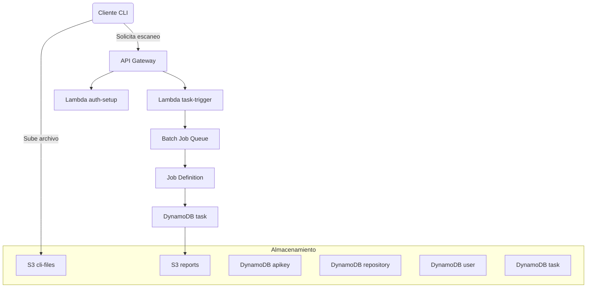

# Titvo Security Scan – Infraestructura AWS

> Infraestructura como código (IaC) lista para desplegar **Titvo Security Scan** en AWS usando **Terraform** y **Terragrunt**.
>
> Diseñada para que cualquier desarrollador –incluso sin mucha experiencia en AWS– pueda levantar, mantener y destruir la plataforma de forma segura y reproducible.

---

## 🗺️ Tabla de contenidos

- [Titvo Security Scan – Infraestructura AWS](#titvo-security-scan--infraestructura-aws)
  - [🗺️ Tabla de contenidos](#️-tabla-de-contenidos)
  - [Introducción](#introducción)
  - [Arquitectura de alto nivel](#arquitectura-de-alto-nivel)
  - [Pre‑requisitos](#prerequisitos)
  - [Estructura del repositorio](#estructura-del-repositorio)
  - [Configuración inicial](#configuración-inicial)
  - [Despliegue rápido](#despliegue-rápido)
  - [Despliegue paso a paso](#despliegue-paso-a-paso)
    - [1 ‑ Provisionar redes (VPC + subnets)](#1--provisionar-redes-vpc--subnets)
    - [2 ‑ Desplegar componentes base (DynamoDB, S3, parámetros, …)](#2--desplegar-componentes-base-dynamodb-s3-parámetros-)
    - [3 ‑ Crear secreto de cifrado (Secrets Manager)](#3--crear-secreto-de-cifrado-secrets-manager)
    - [4 ‑ Desplegar AWS Batch y Lambda functions](#4--desplegar-aws-batch-y-lambda-functions)
    - [5 ‑ Desplegar API Gateway](#5--desplegar-api-gateway)
  - [Destrucción de la infraestructura](#destrucción-de-la-infraestructura)
  - [Preguntas frecuentes](#preguntas-frecuentes)
  - [Contribuir](#contribuir)
  - [Licencia](#licencia)
    - [¿Necesitas ayuda?](#necesitas-ayuda)

---

## Introducción

**Titvo Security Scan** es un servicio de análisis de seguridad de código que se integra con GitHub y Bitbucket. Este repositorio contiene todo el código de infraestructura necesario para operar el servicio en AWS.

* **Terraform** define los recursos (S3, DynamoDB, etc.).
* **Terragrunt** orquesta entornos y regiones, aplicando buenas prácticas DRY.
* **AWS** aloja la solución de forma escalable y de bajo costo.

> **¿Por qué IaC?** Porque versionar la infraestructura permite reproducir entornos, hacer revisiones en PR y auditar cambios fácilmente.

---

## Arquitectura de alto nivel



| Componente                   | Propósito                                  | Notas rápidas                                    |
| ---------------------------- | ------------------------------------------ | ------------------------------------------------ |
| **API Gateway**              | Expone endpoints REST/HTTP                 | Autenticación por API Key + Lambda authorizer    |
| **Lambda (auth‑setup)**      | Gestiona autenticación                     | Valida claves y emite tokens                     |
| **Lambda (task‑trigger)**    | Encola trabajos de escaneo                 | Publica en AWS Batch                             |
| **Lambda (task‑status)**     | Consulta estado                            | Lectura de DynamoDB                              |
| **AWS Batch**                | Ejecuta contenedores de escaneo            | Auto‑scale por demanda                           |
| **S3 (cli-files / reports)** | Almacena archivos origen y reportes        | Versionado activado                              |
| **DynamoDB**                 | Persistencia (users, repos, tasks, apikey) | Todas las tablas usan claves primarias sencillas |
| **SSM Parameter Store**      | Variables de entorno y ARNs                | Evita hard‑codear valores                        |
| **Secrets Manager**          | Secreto AES para cifrado                   | ARN referenciado desde Parameter Store           |

---

## Pre‑requisitos

| Herramienta    | Versión recomendada | Instalación                                                                                                                                                    |
| -------------- | ------------------- | -------------------------------------------------------------------------------------------------------------------------------------------------------------- |
| **Terraform**  | ≥ 1.9.8             | [https://developer.hashicorp.com/terraform/install](https://developer.hashicorp.com/terraform/install)                                                         |
| **Terragrunt** | ≥ 0.69.1            | [https://terragrunt.gruntwork.io](https://terragrunt.gruntwork.io)                                                                                             |
| **AWS CLI**    | ≥ 2.15              | [https://docs.aws.amazon.com/cli/latest/userguide/getting-started-install.html](https://docs.aws.amazon.com/cli/latest/userguide/getting-started-install.html) |
| **Cuenta AWS** | Permisos admin      | Necesaria para crear recursos                                                                                                                                  |

Además:

* Llave de acceso (`AWS_ACCESS_KEY_ID` y `AWS_SECRET_ACCESS_KEY`).
* Conocimientos básicos de línea de comandos.

> ¿Nuevo en Terraform? Revisa [Terraform en 10 min](https://developer.hashicorp.com/terraform/tutorials/aws-get-started/terraform-quick-start).

---

## Estructura del repositorio

```text
.
├── .github/            # Workflows de CI/CD y plantillas de PR
├── common/             # Módulos compartidos (p.ej. DynamoDB común)
├── module/             # Módulos reutilizables (IAM, S3, …)
├── prod/               # Entorno de producción
│   └── us-east-1/      # Región us-east-1
│       ├── account/    # Recursos a nivel cuenta (Dynamo, API GW, …)
│       ├── iam/        # Roles y políticas IAM
│       ├── parameter/  # Parámetros SSM de entorno
│       ├── s3/         # Buckets S3
│       └── task/       # Recursos específicos de tareas (Batch, API GW)
├── utils/              # Scripts auxiliares (VPC, etiquetas, …)
├── common.hcl          # Variables globales
└── terragrunt.hcl      # Terragrunt raíz
```

Cada directorio `*/terragrunt.hcl` hereda de `common.hcl`, lo que evita duplicar código.

---

## Configuración inicial

1. **Clonar el repositorio**

   ```bash
   git clone https://github.com/KaribuLab/titvo-security-scan-infra-aws.git
   cd titvo-security-scan-infra-aws
   ```

2. **Variables de entorno (opcional pero recomendado)** Crea un archivo `.env` con las variables mínimas:

   ```bash
   AWS_ACCESS_KEY_ID="<tu_access_key>"
   AWS_SECRET_ACCESS_KEY="<tu_secret_key>"
   AWS_DEFAULT_REGION="us-east-1"
   PROJECT_NAME="titvo-security-scan"      # Prefijo de recursos
   PARAMETER_PATH="/titvo/security-scan"   # Prefijo de parámetros
   BUCKET_STATE_NAME="titvo-security-scan-terraform-state"
   ```

   Luego:

   ```bash
   source .env
   ```

3. **Estado remoto de Terraform** Terragrunt crea un bucket S3 para guardar el estado con el nombre `BUCKET_STATE_NAME` si no existe.

4. **(Opcional) Etiquetas globales** Crea `common_tags.json` en la raíz para aplicar etiquetas a TODOS los recursos:

   ```json
   { "Project": "Titvo Security Scan", "Team": "Área Creación", "Customer": "Titvo" }
   ```

---

## Despliegue rápido

> Ideal para probar la plataforma en **menos de 10 min**.

```bash
# 1. Crear la VPC de ejemplo
cd utils/prod/us-east-1/vpc
terragrunt apply -auto-approve

# 2. Desplegar el resto de la infraestructura (sin API Gateway)
cd ../../../prod/us-east-1
terragrunt run-all apply -exclude-dir task/apigateway -auto-approve

# 3. Desplegar API Gateway
cd task/apigateway
terragrunt apply -auto-approve
```

> **Nota:** Cada comando puede tardar varios minutos según tu conexión y límites de AWS.

---

## Despliegue paso a paso

### 1 ‑ Provisionar redes (VPC + subnets)

Si ya tienes red, salta a [Paso 2](#2‑desplegar-componentes-base).

```bash
cd utils/prod/us-east-1/vpc
terragrunt apply -auto-approve
```

Registra los IDs resultantes en Parameter Store:

```bash
aws ssm put-parameter --name "/tvo/security-scan/prod/infra/vpc-id" --type String --value "vpc-xxxxxxxx" --region us-east-1
aws ssm put-parameter --name "/tvo/security-scan/prod/infra/subnet1" --type String --value "subnet-xxxxxxxx" --region us-east-1
```

### 2 ‑ Desplegar componentes base (DynamoDB, S3, parámetros, …)

```bash
cd prod/us-east-1
cwd=$(pwd)
for path in \
  account/dynamo/apikey \
  account/dynamo/repository \
  account/dynamo/user \
  parameter/dynamo/parameter \
  s3/cli-files \
  s3/reports \
  task/dynamo/cli-files \
  task/dynamo/task \
  ssm
 do
   cd "$cwd/$path" && terragrunt apply -auto-approve
 done
```

### 3 ‑ Crear secreto de cifrado (Secrets Manager)

```bash
aws secretsmanager create-secret \
  --name "/tvo/security-scan/prod/aes_secret" \
  --secret-string "<mi-clave-aes>" \
  --region us-east-1

aws ssm put-parameter --name "/tvo/security-scan/prod/infra/encryption-key-name" \
  --type String --value "tvo/security-scan/prod/aes_secret" --region us-east-1
```

> [!IMPORTANT]
> Asegúrate de que el secreto sea de 32 bytes (256 bits) y que se guarde en formato `base64`.
> Ejemplo usando `openssl`:
>
> ```bash
> openssl rand -base64 32
> ```

### 4 ‑ Desplegar AWS Batch y Lambda functions

Cada función tiene su propio repositorio con instrucciones detalladas:

* [https://github.com/KaribuLab/titvo-security-scan](https://github.com/KaribuLab/titvo-security-scan)
* [https://github.com/KaribuLab/titvo-auth-setup](https://github.com/KaribuLab/titvo-auth-setup-aws)
* [https://github.com/KaribuLab/titvo-task-cli-files](https://github.com/KaribuLab/titvo-task-cli-files-aws)
* [https://github.com/KaribuLab/titvo-task-trigger](https://github.com/KaribuLab/titvo-task-trigger-aws)
* [https://github.com/KaribuLab/titvo-task-status](https://github.com/KaribuLab/titvo-task-status-aws)

### 5 ‑ Desplegar API Gateway

```bash
cd prod/us-east-1/account/apigateway && terragrunt apply -auto-approve
cd ../task/apigateway              && terragrunt apply -auto-approve
```

---

## Destrucción de la infraestructura

> **Advertencia:** Elimina TODOS los recursos. Úsalo sólo en entornos de prueba.

```bash
cd prod/us-east-1
terragrunt run-all destroy
```

---

## Preguntas frecuentes

| Pregunta                                 | Respuesta breve                                                                                                                       |
| ---------------------------------------- | ------------------------------------------------------------------------------------------------------------------------------------- |
| **¿Terragrunt vs Terraform?**            | Terragrunt actúa como wrapper para reutilizar código, gestionar backends y evitar repetición.                                         |
| **¿Necesito varias AWS CLI profiles?**   | No, mientras apuntes a la cuenta correcta. Para múltiples cuentas usa `AWS_PROFILE`.                                                  |
| **¿Cuánto cuesta?**                      | DynamoDB (On‑Demand) + S3 (storage) + Lambda + Batch. En cuentas nuevas suele entrar en Free Tier, pero monitoriza con Cost Explorer. |
| **Me falla un apply por límites de IAM** | Asegura tener permisos `AdministratorAccess` o los específicos listados en `module/iam-role`.                                         |
| **¿Puedo desplegar en otra región?**     | Sí. Crea `prod/eu-west-1/` replicando la estructura y ajusta `aws_region`.                                                            |

---

## Contribuir

1. Crea tu rama: `git checkout -b feature/mi-nueva-feature`
2. Realiza cambios y escribe pruebas si aplica
3. `git commit -m "feat: añade mi nueva feature"`
4. `git push origin feature/mi-nueva-feature`
5. Abre un **Pull Request** y describe el *por qué* del cambio.

> Sigue el estilo de commit convencional (Conventional Commits) para un historial legible.

---

## Licencia

Distribuido bajo la **Apache 2.0**. Lee el archivo [LICENSE](LICENSE) para más detalles.

---

### ¿Necesitas ayuda?

Abre un *issue* o escribe a **Área Creación – Titvo**.
