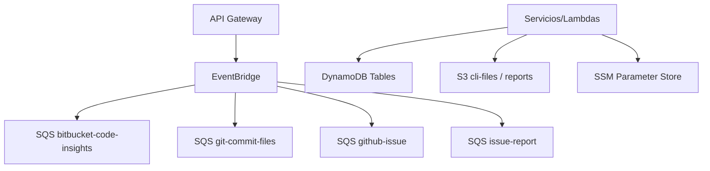

# Titvo Security Scan - Infraestructura AWS

Infraestructura como codigo (IaC) para desplegar Titvo Security Scan en AWS con Terraform y Terragrunt.

Este repositorio orquesta recursos base de la plataforma: DynamoDB, S3, SQS, API Gateway, EventBridge, SSM, VPC e IAM.

## Tabla de contenidos

- [Introduccion](#introduccion)
- [Arquitectura de alto nivel](#arquitectura-de-alto-nivel)
- [Pre-requisitos](#pre-requisitos)
- [Estructura del repositorio](#estructura-del-repositorio)
- [Configuracion inicial](#configuracion-inicial)
- [Scripts auxiliares](#scripts-auxiliares)
- [Paso obligatorio previo](#paso-obligatorio-previo)
- [Despliegue rapido](#despliegue-rapido)
- [Despliegue paso a paso](#despliegue-paso-a-paso)
- [Destruccion de infraestructura](#destruccion-de-infraestructura)
- [Preguntas frecuentes](#preguntas-frecuentes)

## Introduccion

Titvo Security Scan es un servicio de analisis de seguridad de codigo que integra procesamiento asincrono con AWS.

- Terraform define los recursos.
- Terragrunt organiza entornos y reduce duplicacion.
- La configuracion compartida vive en `common.hcl`.

## Arquitectura de alto nivel


```mermaid
flowchart TD
    API[API Gateway] --> EV[EventBridge]
    EV --> SQS1[SQS bitbucket-code-insights]
    EV --> SQS2[SQS git-commit-files]
    EV --> SQS3[SQS github-issue]
    EV --> SQS4[SQS issue-report]
    APP[Servicios/Lambdas] --> DDB[DynamoDB Tables]
    APP --> S3[S3 cli-files / reports]
    APP --> SSM[SSM Parameter Store]
```

## Pre-requisitos

- Terraform >= 1.9
- Terragrunt >= 0.69
- AWS CLI >= 2.x
- Credenciales AWS con permisos suficientes para crear recursos

## Estructura del repositorio

```text
.
├── module/                  # Modulos terraform locales reutilizables
├── prod/
│   └── us-east-1/
│       ├── apigateway/
│       │   ├── account/
│       │   └── task/
│       ├── cloudmap/
│       ├── dynamo/
│       │   ├── apikey/
│       │   ├── cli-files/
│       │   ├── parameter/
│       │   ├── prompt/
│       │   ├── repository/
│       │   ├── session/
│       │   ├── task/
│       │   └── user/
│       ├── ecs/
│       ├── eventbridge/
│       ├── iam/
│       │   └── amplify/
│       ├── s3/
│       │   ├── cli-files/
│       │   └── reports/
│       ├── sqs/
│       │   ├── bitbucket-code-insights/{input,output}/
│       │   ├── git-commit-files/{input,output}/
│       │   ├── github-issue/{input,output}/
│       │   └── issue-report/{input,output}/
│       ├── ssm/
│       │   └── paremeter/
│       │       ├── lookup/
│       │       └── upsert/
│       └── vpc/
│           ├── security-group/
│           └── subnet/private/
├── scripts/                 # Scripts bash para carga de parametros/secrets
├── utils/
├── common.hcl
└── terragrunt.hcl
```

Nota: el path `ssm/paremeter/*` se mantiene asi porque actualmente existe con ese nombre en el repo.

## Configuracion inicial

1. Clona el repositorio

```bash
git clone https://github.com/KaribuLab/titvo-security-scan-infra-aws.git
cd titvo-security-scan-infra-aws
```

2. Exporta credenciales AWS

```bash
export AWS_ACCESS_KEY_ID="<tu_access_key>"
export AWS_SECRET_ACCESS_KEY="<tu_secret_key>"
export AWS_DEFAULT_REGION="us-east-1"
export AWS_ACCOUNT_ID="123456789012"
```

3. (Opcional) Crea `common_tags.json` en raiz

```json
{
  "Project": "Titvo Security Scan Infrastructure",
  "Team": "Area Creacion"
}
```

## Scripts auxiliares

En `scripts/` existen utilidades para cargar parametros rapidamente:

- `scripts/vpc_parameters.sh`: publica VPC/subnet en SSM.
- `scripts/secret_parameters.sh`: crea secreto en Secrets Manager y publica referencias en SSM.
- `scripts/utils.sh`: helpers de shell (carga de `.env`).

Variables esperadas en `.env` para estos scripts:

```bash
VPC_ID="vpc-xxxxxxxx"
SUBNET_ID="subnet-xxxxxxxx"
SECRET_NAME="/tvo/security-scan/prod/aes_secret"
SECRET_KEY="<base64-32-bytes>"
```

Ejemplos:

```bash
cd scripts
bash vpc_parameters.sh
bash secret_parameters.sh
```

## Paso obligatorio previo

Antes de ejecutar cualquier comando de Terraform/Terragrunt sobre la infraestructura, ejecuta primero:

```bash
cd prod/us-east-1/ssm/paremeter/lookup
terragrunt apply -auto-approve
```

Esto inicializa parametros base consumidos por otros modulos y evita bloqueos/errores en dependencias.

## Despliegue rapido

```bash
# 0. Paso obligatorio previo
cd prod/us-east-1/ssm/paremeter/lookup
terragrunt apply -auto-approve

# VPC utilitaria (si aplica en tu flujo)
cd utils/prod/us-east-1/vpc
terragrunt apply -auto-approve

# Infraestructura productiva
cd ../../../prod/us-east-1
terragrunt run-all apply -auto-approve
```

## Despliegue paso a paso

### 0) Paso obligatorio previo

```bash
cd prod/us-east-1/ssm/paremeter/lookup
terragrunt apply -auto-approve
```

### 1) Red base

```bash
cd utils/prod/us-east-1/vpc
terragrunt apply -auto-approve
```

### 2) Almacenamiento y persistencia

```bash
cd prod/us-east-1
cwd=$(pwd)

for path in \
  dynamo/apikey \
  dynamo/cli-files \
  dynamo/parameter \
  dynamo/prompt \
  dynamo/repository \
  dynamo/session \
  dynamo/task \
  dynamo/user \
  s3/cli-files \
  s3/reports
do
  cd "$cwd/$path" && terragrunt apply -auto-approve
done
```

### 3) Mensajeria y enrutamiento

```bash
cd prod/us-east-1
cwd=$(pwd)

for path in \
  sqs/bitbucket-code-insights/input \
  sqs/bitbucket-code-insights/output \
  sqs/git-commit-files/input \
  sqs/git-commit-files/output \
  sqs/github-issue/input \
  sqs/github-issue/output \
  sqs/issue-report/input \
  sqs/issue-report/output \
  eventbridge
do
  cd "$cwd/$path" && terragrunt apply -auto-approve
done
```

### 4) Servicios de plataforma

```bash
cd prod/us-east-1
cwd=$(pwd)

for path in \
  apigateway/account \
  apigateway/task \
  ecs \
  cloudmap \
  vpc/security-group \
  vpc/subnet/private \
  iam/amplify \
  ssm/paremeter/lookup \
  ssm/paremeter/upsert
do
  cd "$cwd/$path" && terragrunt apply -auto-approve
done
```

## Destruccion de infraestructura

Advertencia: elimina recursos del entorno.

```bash
cd prod/us-east-1
terragrunt run-all destroy
```

## Preguntas frecuentes

**Terragrunt vs Terraform?**
Terragrunt actua como wrapper para reutilizar configuracion, gestionar includes y evitar duplicacion.

**Donde se definen valores compartidos?**
En `common.hcl` (por ejemplo: `project_name`, `project_prefix`, `parameter_path`, `tags`, `provider_version`).

**Que convencion usan eventos SQS en EventBridge?**
`source` usa `mcp.tool.<dominio>` y `detail-type` usa `input` o `output`.
